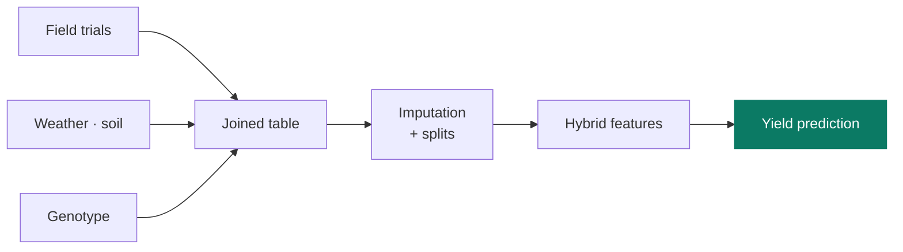

<h1>Predicting Maize Yield Across Genotypes and Environments</h1>

<strong>Our entry in an international prediction competition, written to be reproduced end to end.</strong>

Ved Piyush · PhD in Statistics · University of Nebraska–Lincoln

---

**The problem.** A maize variety that performs well in Iowa may do poorly in Texas. Yield depends on the
variety (**genotype**), on the growing conditions (**environment**), and on the interaction between the two — and
that interaction is where the difficulty lives. Predicting it well means a breeder can test fewer varieties in
fewer places.

**The competition.** The Genomes to Fields initiative released years of field trial data and invited teams to
predict yields for unseen genotype-environment combinations. We entered as team **DeepCropVision**. The organisers
compared all entries and published the collective finding — that many different modelling strategies performed
comparably well — in *Genetics*.

## How it fits together

## What the code does

Four notebooks forming a linear pipeline. Data preprocessing joins the trial records with weather, soil and
management information. Because field data is inevitably incomplete, a dedicated notebook handles **imputation** of
missing values alongside the train/test split. Hybrid genotype features are constructed separately, since a hybrid
variety derives from two parent lines and needs its own encoding. The modelling notebook then fits and evaluates
the predictors.

## Running it

1. `Data_PreProcessing.ipynb` builds the joined table `final_data_all_with_traits.csv`.
2. `Hybrid_Features.ipynb` adds genotype features for hybrid varieties.
3. `Train_Test_Split_Imputations.ipynb` handles missing values and builds the splits.
4. `Modeling_Script.ipynb` fits and evaluates the models.

## Where to look first

- **`Data_PreProcessing.ipynb`** — run first — everything downstream needs its output
- **`Modeling_Script.ipynb`** — the models and their evaluation

## Notes

> Notebook outputs are committed, so the figures and result tables render on GitHub without running anything. Competition data is distributed by the Genomes to Fields initiative and is not redistributed here.

Research code from my doctoral work at the University of Nebraska–Lincoln (4 notebooks). Previously hosted at `github.com/Ved-Piyush/DeepCropVision_maizegxeprediction2022`.

---

**Ved Piyush, PhD** · [Website](https://vedpiyush93-stack.github.io) · [Google Scholar](https://scholar.google.com/citations?hl=en&user=657rVYAAAAAJ) · [vedpiyush93@gmail.com](mailto:vedpiyush93@gmail.com)

